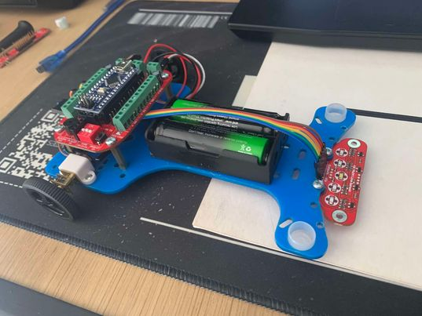

# LineFollower

lege repository die je als template kan gebruiken om een eigen repository te starten voor uw linefollower project

  
## specifications

microcontroller: Arduino Nano

motors: DC gear metal motor 50:1 6V 650RPM

h-bridge: L293

sensors: 4K multi line Sensor/ QTR8A

batteries: Li-ion 19800mAh 8,4V max

wireless communication: /

Sensor - Motors: 15cm

weight: 196g

speed: ???

